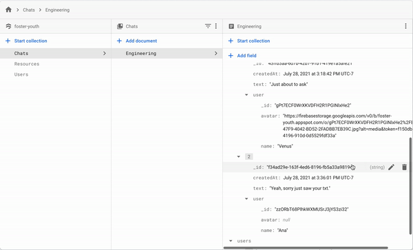

# Fostering Hope @snap

# Introduction

> “Fostering Hope @ Snap” allows foster youth to have access to local resources like housing, food banks and creative arts programs through a kinder, easier, interactive SnapMap.

[Click here](https://youtu.be/pQwJ-JRY2d0) to watch our video.

# Main Features

## Different resources on the map

> The map provides some basic information like the locations and contacts, which is collected from our trusted resources and stored in our database. Different icons for food banks, creative art programs, and shelters are included.


## Introduction Video

> For our users to have a better understanding of the organization, we provided an option button called ‘ABOUT US’, once the user presses the button it would direct them to another screen where they will see an introduction video of the organization that explains what they do and what they provide them.


## AI Chat

> They can quickly ask for more detailed information of each organization via an AI Chat.


# Installation, Set up, & Run

## Install

> 1.  Clone this repo to your personal device.
>     (You can checkout [this documentation](https://help.github.com/en/articles/cloning-a-repository) for more information on how to do this.)
> 2.  Set up your database to look something like what is shown below, then put it inside the fireside.js file.
>     (You can checkout [FireBase documentation](https://firebase.google.com/docs/web/setup) for more information on how to set this up.)



Note: Download [Expo Go](https://expo.dev/client) on your phone for better experience when running the program.

## Set up

```
cd ChapSnat-FosteringHope
```

```
yarn install
```

```
git checkout main
```

## Run

```
expo start
```

# Technologies Used

- [React Native](https://reactnative.dev/docs/getting-started)
- [React Native Elements](https://reactnativeelements.com/docs/)
- [Expo](https://docs.expo.dev/index.html)
- [FireBase](https://firebase.google.com/docs)

# Project Team Members

| Name   | Role        | Link to GitHub / LinkedIn                                                                             |
| ------ | ----------- | ----------------------------------------------------------------------------------------------------- |
| Ana    | Engineer    | [GitHub](https://github.com/alopez651) / [LinkedIn](https://www.linkedin.com/in/ana-lopez-38573a20a/) |
| Venus  | Engineer    | [GitHub](https://github.com/VenusNguyen) / [LinkedIn](https://www.linkedin.com/in/venus-nguyen/)      |
| Terran | Designer    | [LinkedIn](https://www.linkedin.com/in/terran-ray-lawrence-2128b920a/)                                |
| Jake   | Designer    | [LinkedIn](https://www.linkedin.com/in/jakelouismata/)                                                |
| Shari  | Storyteller | [LinkedIn](https://www.linkedin.com/in/sharielizabethwalker/)                                         |
| Luis   | Storyteller | [LinkedIn](https://www.linkedin.com/in/luis-felipe-cortez-a10b041a6/)                                 |

# Acknowledgements

- [ChapSnat Template](https://github.com/Snap-Engineering-Academy-2021/chapsnat-sandbox)
- [React Native Gifted Chat](https://github.com/FaridSafi/react-native-gifted-chat)
- [Reactive Gesture Bottom Sheet](https://www.npmjs.com/package/react-native-gesture-bottom-sheet)
